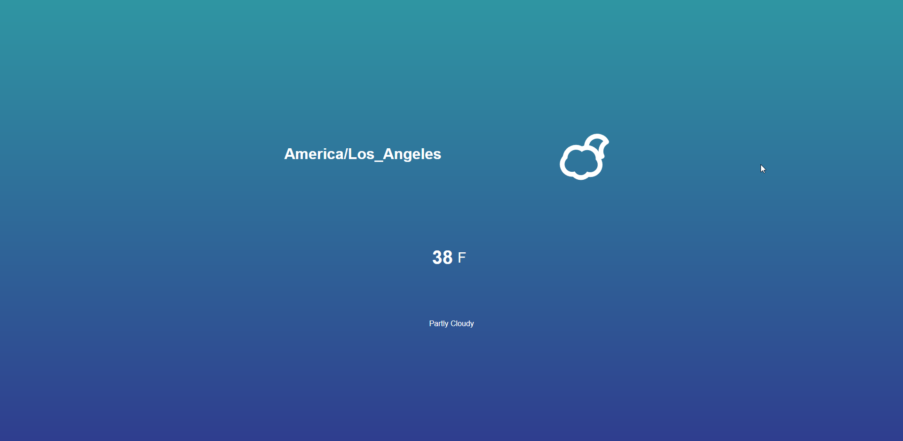

# Weather-App

This is a web application that detects your current location (if you allow it) and displays the current weather using the Dark Sky API.

# Installation

Download/clone the whole project and run `index.html` in your favorite browser!

# Other

Followed a [YouTube tutorial by Dev Ed](https://www.youtube.com/watch?v=wPElVpR1rwA).
